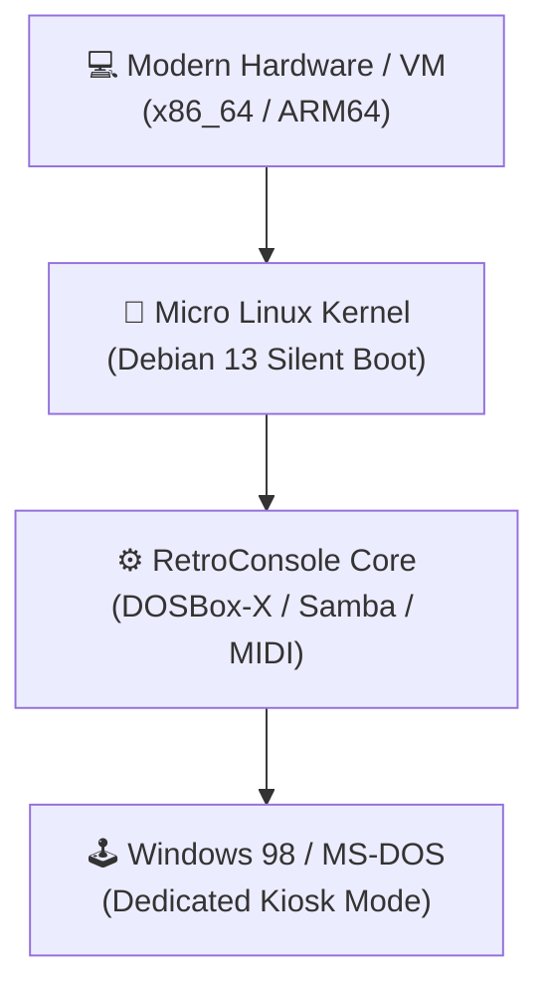

# 🎮 RetroConsole OS

> **Turn any modern PC, laptop, or Raspberry Pi into a dedicated Windows 98 machine.**

> **RetroConsole is not an emulator launcher.** It is a complete, self-contained retro operating environment built to make modern hardware behave like a dedicated 1998 computer.

---

## 📸 Screenshots & Showcase

| Phase 1: Custom Installer | Phase 2: Setup Slideshow |
| :---: | :---: |
|  |  |

| Award BIOS POST Screen | Running Windows 98 |
| :---: | :---: |
|  |  |

---

## ⚡ Why RetroConsole?

* **✔ Zero Driver Hunting:** No legacy SATA, GPU, or motherboard driver headaches.
* **✔ Bare-Metal Feel:** Boots seamlessly with Award BIOS POST simulations and zero Linux text.
* **✔ Plug & Play Media:** Insert a USB flash drive with ISOs — RetroConsole handles the rest.
* **✔ Perfect Audio Hardware:** Built-in General MIDI via FluidSynth, SB16/AWE32 & GUS support.
* **✔ Modern Network Bridge:** Integrated SMBv1 Samba server to transfer files from main PC.
* **✔ Hardware Accelerated:** OpenGL rendering for crisp scaling without aspect ratio distortion.

---

## 🏗️ Architecture

---

## 💻 Supported Platforms

| Platform | Status | Notes |
| :--- | :---: | :--- |
| **x86_64 (Ryzen / Core)** | ✅ | Tested, maximum performance |
| **Legacy x86 PCs (~2005+)** | ✅ | Great performance with dynamic CPU core |
| **VMs (QEMU/VMware/VBox)** | ✅ | Native framebuffer & 3D support |
| **Hyper-V** | ✅ | Works via custom display buffers |
| **Raspberry Pi 5 (ARM64)** | 🚧 | In testing; Win98 boots fine |

---

## 🗺️ Project Roadmap

### Implemented Features
- [x] **Zero-Touch Custom ISO Installer** (Patched Debian 13 GTK Installer)
- [x] **Silent Boot Engine** (Suppressed Linux, GRUB, and systemd outputs)
- [x] **Award BIOS POST Simulation** (Custom Plymouth theme)
- [x] **Win98 Setup Promotional Slideshow** (Phase 2 deployment)
- [x] **Automatic USB Import Rules** (udev auto-sync for ISOs)
- [x] **Samba (SMBv1) Network Share**
- [x] **FluidSynth + General MIDI Integration**
- [x] **APM Power Off Integration** (Shutdown via Windows Start Menu)

### Planned Features
- [ ] **Advanced ACPI & Sleep State Controls**
- [ ] **Official Raspberry Pi 5 Ready-to-Flash Image**
- [ ] **RetroCloud Cross-Device Save Sync**
- [ ] **Web-based Game Library Manager**

---

## 💿 Dual-Phase Installation Process

1. **Phase 1: Zero-Touch ISO Installer** — Patched `RetroConsole System Setup` GTK installer. Automatically formats drive and extracts base system quietly.
2. **Phase 2: First-Boot Experience** — Boots into a **Windows 98 Setup** Plymouth slideshow while downloading image, building DOSBox-X, and setting up network/audio.
3. **Finish:** Switches to Award BIOS boot screen, reboots automatically, and launches directly into Windows 98.

---

## ☁️ Coming Soon: RetroCloud Ecosystem

**RetroCloud** is an upcoming cloud storage and synchronization service for RetroConsole:
* **Cross-Device Save Sync:** Automatic cloud backup and synchronization of game saves across RetroConsole, PCs, and mobile devices.
* **Legacy Bridge:** Linking WebRTC/P2P APIs with vintage protocols (SMBv1, FTP) inside Windows 98.
* **Zero-Install Web Dashboard:** Browser-based ISO library and save state manager.

---

## 🛠️ System Requirements

* **CPU:** 64-bit Dual-Core x86_64 or ARM64
* **RAM:** 2 GB Minimum (4 GB Recommended)
* **Storage:** 8 GB Free Space (SSD Recommended)
* **Graphics:** OpenGL 2.1+ compatible GPU
