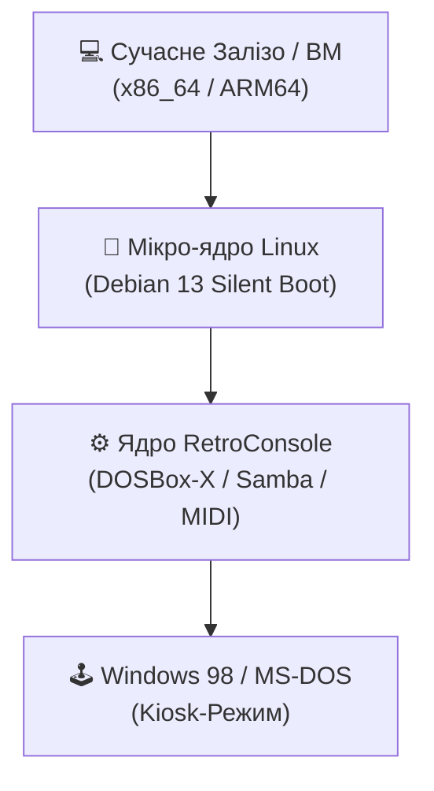

# 🎮 RetroConsole OS

> **Перетворіть будь-який сучасний ПК, ноутбук чи Raspberry Pi на виділений комп'ютер з Windows 98.**

> **RetroConsole — це не просто лаунчер емуляторів.** Це повноцінне автономне операційне середовище, створене для того, щоб сучасне залізо поводилося як ПК 1998 року.

---

## 📸 Галерея та Демонстрація

| Фаза 1: Кастомний Інсталятор | Фаза 2: Промо-Слайдшоу |
| :---: | :---: |
|  |  |

| POST-екран Award BIOS | Робочий стіл Windows 98 |
| :---: | :---: |
|  |  |

---

## ⚡ Чому саме RetroConsole?

* **✔ Без пошуку драйверів:** Жодних проблем із легасі-драйверами під сучасні SATA, NVMe чи GPU.
* **✔ Відчуття справжнього заліза:** Завантажується з імітацією Award BIOS та без тексту Linux.
* **✔ Автоматичний USB-імпорт:** Вставте флешку з ISO — система все скопіює сама.
* **✔ Ідеальний ретро-звук:** General MIDI через FluidSynth, підтримка SB16/AWE32 та GUS.
* **✔ Мережевий міст із ПК:** Інтегрована Samba (SMBv1) для швидкого обміну файлами.
* **✔ Апаратне прискорення:** Чітке та плавне масштабування графіки через OpenGL.

---

## 🏗️ Архітектура

---

## 💻 Підтримувані Платформи

| Платформа | Статус | Примітки |
| :--- | :---: | :--- |
| **x86_64 (Ryzen / Core)** | ✅ | Тестовано, максимальна швидкість |
| **Legacy ПК (~2005+ р.)** | ✅ | Відмінно працює з dynamic CPU core |
| **ВМ (QEMU/VMware/VBox)** | ✅ | Підтримка фреймбуфера та 3D |
| **Hyper-V** | ✅ | Працює через кастомні графічні буфери |
| **Raspberry Pi 5 (ARM64)** | 🚧 | У тестуванні; Win98 завантажується |

---

## 🗺️ Roadmap Проєкту

### Реалізовано
- [x] **Автоматизований ISO-Інсталятор** (Патчений Debian 13 GTK Installer)
- [x] **Режим Silent Boot** (Приховано весь текст Linux, GRUB та systemd)
- [x] **Імітація Award BIOS POST** (Кастомна тема Plymouth)
- [x] **Промо-слайдшоу Windows 98 Setup** (Екран розгортання для Фази 2)
- [x] **Авто-імпорт з USB** (udev правила для автоматичного копіювання ISO)
- [x] **Мережева папка Samba (SMBv1)**
- [x] **Інтеграція FluidSynth + General MIDI**
- [x] **Інтеграція вимкнення APM** (Вимкнення ПК через меню «Завершення роботи»)

### Заплановано
- [ ] **Розширене керування ACPI та режимами сну**
- [ ] **Готовий образ для записання на SD-карту Raspberry Pi 5**
- [ ] **Хмарна синхронізація збережень RetroCloud**
- [ ] **Веб-панель керування ігровою бібліотекою**

---

## 💿 Двофазний Процес Встановлення

1. **Фаза 1: Автоматичний ISO-Інсталятор** — Патчений GTK-інсталятор `RetroConsole System Setup`. Автоматично форматує диск та розгортає систему без запитань.
2. **Фаза 2: Перший Запуск** — Plymouth-слайдшоу у стилі **Windows 98 Setup** під час завантаження образу, збірки DOSBox-X та налаштування мережі.
3. **Фінал:** Перемикається на тему Award BIOS, перезавантажується та запускає Windows 98.

---

## ☁️ Незабаром: Хмарний Сервіс RetroCloud

**RetroCloud** — майбутня хмарна екосистема синхронізації даних для RetroConsole:
* **Кросплатформена синхронізація:** Авто-бекап збережень між RetroConsole, ПК та мобільними пристроями.
* **Міст між епохами:** Поєднання WebRTC/P2P API з легасі-протоколами (SMBv1, FTP) всередині Windows 98.
* **Веб-панель:** Браузерний інтерфейс для керування ISO-бібліотекою та сейвами.

---

## 🛠️ Системні Вимоги

* **Процесор:** 64-бітний двоядерний x86_64 або ARM64 CPU
* **RAM:** 2 ГБ Мінімум (4 ГБ Рекомендовано)
* **Дисковий простір:** 8 ГБ вільного місця (SSD)
* **Відеокарта:** З підтримкою OpenGL 2.1+
